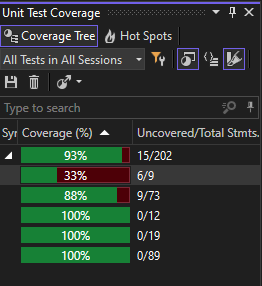
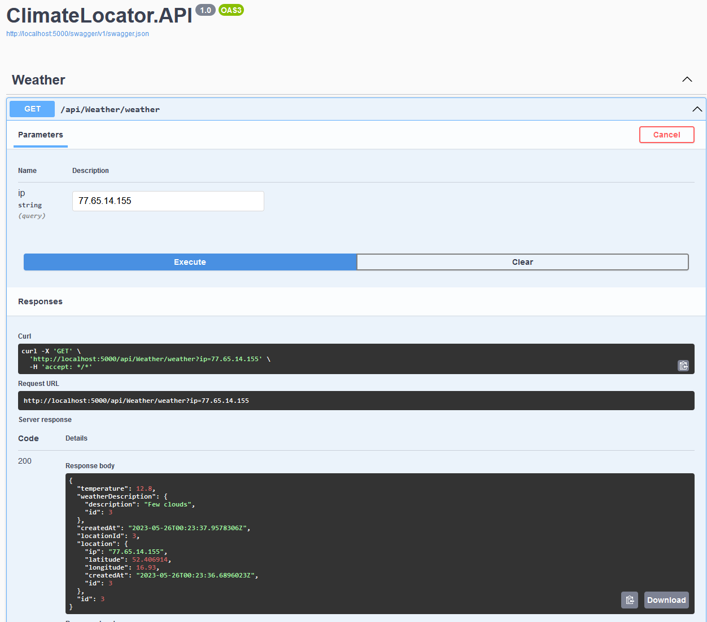

# ClimateLocator

ClimateLocator is an application that provides weather information based on location. It uses IP geolocation to determine the user's location and fetches weather data from the Weatherbit API.

## Features

- Retrieves the user's location based on their IP address.
- Fetches current weather information for the location.
- Displays the temperature and weather description.

## Prerequisites

Before running the ClimateLocator application, ensure you have the following:

- .NET Core SDK installed
- Weatherbit API key
- Geolocation API key

## Key Note

In a real solution, the user's IP address can be fetched using `Request.HttpContext.Connection.RemoteIpAddress`. However, for the sake of simplicity and the ability to test a variety of IP addresses, this implementation of ClimateLocator uses the IP address as an argument for the controller.

## Getting Started

Follow these steps to get started with ClimateLocator:

1. Clone the repository:

```
git clone https://github.com/RDobelis/ClimateLocator.git
```

2. Navigate to the project directory:

```
cd ClimateLocator
```

3. Update the appsettings.json file with your Weatherbit and Geolocation API keys:

```json
{
  "WeatherApiKey": "YOUR_WEATHERBIT_API_KEY",
  "GeolocationApiKey": "YOUR_GEOLOCATION_API_KEY"
}
```

4. Build the application:

```
dotnet build
```

5. Run the application:

```
dotnet run
```

6. Access the application in your browser at `http://localhost:5000`.

## Tests

To run the tests for ClimateLocator, use the following command:

```
dotnet test
```

## Contributing

Contributions to ClimateLocator are welcome! If you find a bug or want to suggest an enhancement, please open an issue or submit a pull request.

```

Feel free to modify and expand this template to fit the specific details and requirements of your ClimateLocator application. You can add additional sections, such as Architecture, Deployment, API Documentation, or Usage Examples, depending on your application's complexity and needs.

Remember to replace the placeholders (e.g., `YOUR_WEATHERBIT_API_KEY`, `YOUR_GEOLOCATION_API_KEY`, `your-username`) with the actual values relevant to your application and repository.
```

## Author

This application was developed by Rihards Dobelis. 

## Screenshots

<p align="center">
  <b>Unit tests</b><br>
  
</p>

<p align="center">
  <b>WeatherController</b><br>
  
</p>
